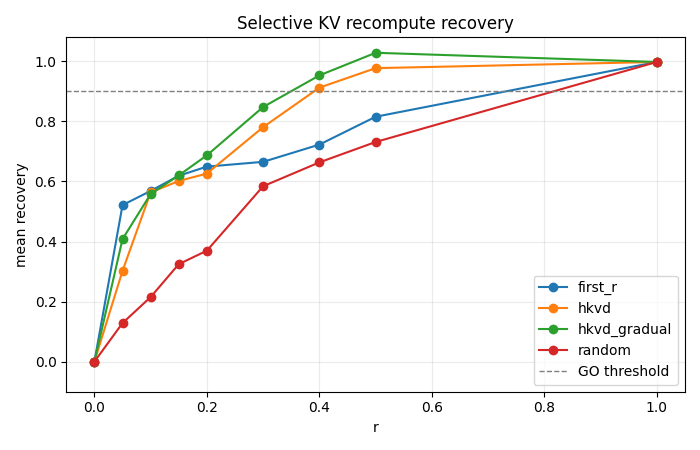
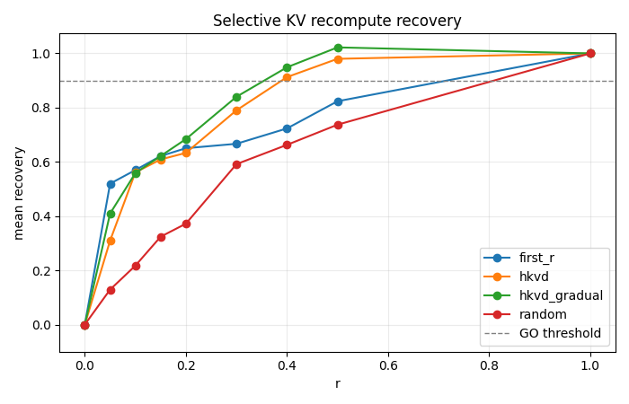

# KV Recompute Eval

Evaluation harness for measuring KV-cache staleness in RAG-style prefill reuse.

The core question:

> If retrieved chunks are prefilled before the final query arrives, how much
> answer-quality loss comes from reusing those stale chunk KV caches, and how
> much can selective recomputation recover?

This repo isolates that effect for Llama-style causal models. It compares full
prompt prefill against chunk-local prefill, then evaluates CacheBlend-style
selective recomputation strategies that repair only part of the stale prefix.

## What It Compares

| Path | Prefix construction | Query handling | Purpose |
|---|---|---|---|
| `gold` | Full prefill over `system + chunks` | Online-prefill query, then score answer | Upper-bound quality from a fresh prefix |
| `stale` | Prefill `system`; prefill each chunk independently at its final global RoPE position; concatenate KV caches | Online-prefill query over the stale prefix | Measures the quality loss caused by missing system and cross-chunk attention |
| `hybrid` | Start from the stale prefix, then selectively recompute chunk positions layer by layer | Online-prefill query over the repaired prefix | Measures quality recovered per recompute budget |

## Why This Matters

Long-context RAG serving spends a large share of request time in prefill. A
natural optimization is to precompute KV for reusable retrieved chunks, but a
chunk prefetched in isolation is not equivalent to the same chunk inside the
final prompt. It cannot attend to the system prompt or earlier chunks, so later
K/V tensors become stale.

This project gives that tradeoff a tight testbed:

- How bad is independently-prefilled chunk KV?
- Which token positions are worth recomputing?
- How close can a partial recompute get to full-prefill answer scoring?
- Do endpoint invariants hold: `r=0 -> stale`, `r=1 -> gold`?

## Features

- Gold, stale, and hybrid scoring paths for Llama-compatible causal LMs.
- RoPE-correct per-segment prefill via explicit global `position_ids`.
- `DynamicCache` concatenation with model-derived shape checks for GQA models.
- Answer mean-NLL / perplexity scoring cross-checked against full-forward
  scoring.
- CacheBlend-style layer-by-layer recomputation over a merged fresh/stale cache.
- Static selection strategies: `random`, `first_r`, and `hkvd`.
- Dynamic `hkvd_gradual` strategy with per-layer re-ranking and gradual
  narrowing.
- JSONL sweep runner with per-instance metrics, Markdown summary, and recovery
  curve plot.
- Synthetic multi-source QA dataset with schema and token-budget validation.
- Correctness gates for stale-cache sanity, hybrid endpoints, HKVD behavior,
  model config drift, and dataset quality.

## Repository Layout

```text
src/
  config.py       Env-driven model, device, dtype, and tokenizer loading
  data.py         JSONL loading, schema validation, tokenization helpers
  prefill.py      Gold, chunk-local, and online prefill primitives
  cache_ops.py    KV concatenation and selective recompute implementations
  selection.py    Random, first-r, and HKVD position selection
  metrics.py      Answer NLL / PPL measurement
  experiment.py   End-to-end gold, stale, and hybrid runners

scripts/
  run_sweep.py    Batch sweep over strategies and recompute ratios

data/
  synthetic_qa.jsonl

tests/
  Correctness tests for the evaluation pipeline
```

Generated sweep artifacts are written under `results/`, which is ignored by git.

## Setup

Requirements:

- Python `>=3.11,<3.12`
- `uv`
- Hugging Face access to the selected Llama model

Install dependencies:

```bash
uv sync
```

The default development configuration runs the 1B Llama model on CPU:

```bash
MODEL_ID=meta-llama/Llama-3.2-1B-Instruct
DEVICE=cpu
DTYPE=float32
```

For a larger GPU sweep:

```bash
MODEL_ID=meta-llama/Llama-3.1-8B-Instruct \
DEVICE=cuda \
DTYPE=bfloat16 \
uv run python scripts/run_sweep.py
```

Llama weights are gated on Hugging Face. Accept the model license and run
`huggingface-cli login` before the first load if needed.

Supported `DTYPE` values are `float32`, `bfloat16`, and `float16`.

## Quickstart

Run the test suite:

```bash
uv run pytest
```

Most tests load the configured Hugging Face model. The first run may download
several GB of weights.

Run a small smoke sweep:

```bash
uv run python scripts/run_sweep.py --max-instances 5
```

Run the default full grid:

```bash
uv run python scripts/run_sweep.py
```

The default grid is:

```text
strategies = random, first_r, hkvd, hkvd_gradual
r values   = 0.00, 0.05, 0.10, 0.15, 0.20, 0.30, 0.40, 0.50, 1.00
dataset    = data/synthetic_qa.jsonl
seed       = 0
```

Run a custom sweep:

```bash
uv run python scripts/run_sweep.py \
  --dataset data/synthetic_qa.jsonl \
  --results-dir results \
  --strategies random first_r hkvd hkvd_gradual \
  --r-values 0.0 0.05 0.10 0.15 0.20 0.30 0.40 0.50 1.0 \
  --seed 0
```

The sweep writes:

- `results/run_<timestamp>.jsonl`: per-instance metrics for every strategy and
  recompute ratio.
- `results/summary.md`: aggregate mean PPL and recovery table.
- `results/recovery_curve.png`: recovery vs. recompute-ratio plot.

## Sweep Results

BF16 sweep:



FP32 sweep:



Both BF16 and FP32 sweeps show nearly the same recovery pattern. The HKVD-based
methods recover quality much faster than the random baseline: both `hkvd` and
`hkvd_gradual` pass roughly 0.90 recovery around `r=0.40`, while `random`
improves more slowly and only reaches the gold endpoint at full recompute.
`first_r` is a stronger baseline than random at small `r`, but it still trails
the HKVD methods once the recompute ratio increases.

The close match between the BF16 and FP32 curves suggests that the main trend is
not a dtype artifact.

## Metrics

The runner scores the reference answer by mean negative log-likelihood:

```text
mean_nll = -mean(log p(answer_token | prefix, previous_answer_tokens))
PPL      = exp(mean_nll)
```

Selective recompute quality is reported as recovery:

```text
recovery = (PPL_stale - PPL_hybrid) / (PPL_stale - PPL_gold)
```

Interpretation:

- `0.0`: hybrid behaves like the stale cache.
- `1.0`: hybrid recovers the full-prefill gold result.
- `< 0.0`: recompute hurt quality.
- `> 1.0`: possible numerically, but worth inspecting.

Sweep summaries compute recovery as a ratio of mean PPLs, not as the mean of
per-instance recovery ratios. This avoids unstable aggregates when a single
instance has a tiny `PPL_stale - PPL_gold` denominator.

## Selection Strategies

| Strategy | Selection rule | Notes |
|---|---|---|
| `random` | Uniformly samples `round(r * chunk_tokens)` positions from the chunk span | Baseline |
| `first_r` | Selects the first `r` fraction of each chunk | Cheap structural baseline |
| `hkvd` | Selects top-`r` chunk positions by layer-1 KV deviation | Static CacheBlend-style ranking |
| `hkvd_gradual` | Re-ranks live positions at each layer using fresh-vs-stale deviation | Dynamic narrowing variant |

HKVD stands for High KV Deviation. The static `hkvd` score for each chunk
position is:

```text
sqrt(||K_gold - K_stale||^2 + ||V_gold - V_stale||^2)
```

Layer 1 is used because layer-0 K/V is mostly a function of token identity and
position. The first meaningful stale-cache divergence appears only after a layer
has attended to the wrong context.

`hkvd_gradual` recomputes the full chunk range through layer 1, ranks by
fresh-vs-stale deviation, and narrows the live position set across deeper
layers.

## Dataset Format

The dataset is JSONL. Each line is one QA instance:

```json
{
  "id": "instance_001",
  "sys": "You are a helpful assistant answering questions about the user's personal data. Be concise.",
  "query": "When is my dentist appointment and what should I bring?",
  "answer": "Your cleaning with Dr. Lin is on Thursday June 5 at 2:30 PM. Bring your new insurance card and the completed intake form...",
  "chunks": {
    "chunk_0": {
      "text": "Email from Bayview Dental: your appointment is confirmed for Thu Jun 5, 2:30pm...",
      "source": "email",
      "retrieval_rank": 1
    }
  }
}
```

Chunks are rendered in ascending `retrieval_rank` order. Valid sources are
`contacts`, `messages`, `calendar`, `email`, and `notes`.

The included synthetic dataset contains 50 multi-chunk personal-data QA
examples. Tests enforce:

- non-empty data and unique IDs
- realistic chunk counts
- source coverage across the dataset
- one consistent system prompt
- deterministic retrieval-rank ordering
- token budgets for dev-time runs

## Correctness Gates

The test suite is organized around correctness gates:

- **Gold scoring**: prefill-plus-decode scoring matches a full forward pass.
- **Gate A1**: stale equals gold for a degenerate no-system, single-chunk case.
- **Gate A2**: stale and gold prefix K/V shapes match for `system + one chunk`,
  and stale PPL remains finite and bounded.
- **Multi-chunk sanity**: stale PPL should not beat gold PPL, and the ratio
  should stay bounded.
- **Hybrid endpoints**: `r=0` equals stale and `r=1` equals gold for every
  strategy.
- **HKVD middle-r sanity**: `hkvd` and `hkvd_gradual` at `r=0.15` should land
  between stale and gold within dtype-dependent tolerance.
- **Model config checks**: Llama 3.2 1B and Llama 3.1 8B head counts, head dims,
  layer counts, and RoPE scaling are asserted to catch silent config drift.
- **Dataset validation**: schema, ordering, source coverage, and token budgets
  are checked before using the synthetic dataset for sweeps.

## Technical Notes

- System prompt KV is prefilled at position 0 and is identical between stale and
  gold paths; only chunk positions are selected for recomputation.
- Chunks are independently prefilled at their final global positions, so the
  experiment measures missing attention context rather than positional mismatch.
- Query tokens are always online-prefilled on top of the chosen prefix cache.
  Prefix staleness therefore propagates into query K/V, matching the serving
  scenario being evaluated.
- Scoring holds back the last query token so every answer token, including the
  first one, has a predicting logit.
- Static recompute strategies and `hkvd_gradual` share a layer-1 full-chunk
  warmup so their recompute budgets are comparable.
- Shape assertions derive `num_key_value_heads` and `head_dim` from model config
  instead of hard-coding Llama dimensions.
- Grouped-query attention is supported by repeating KV heads only for the
  attention matmul while storing cache tensors in KV-head shape.
